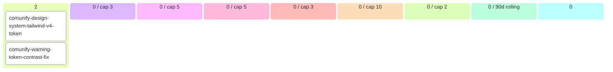

# Comunify Backlog (auto-generated)

> Generated at: `2026-05-18T18:32:23+00:00`
> DO NOT EDIT MANUALLY — modify source artifacts.
> Regenerate: `python scripts/generate_backlog.py`

## 📊 Roadmap view (filtered + curated)

### 💡 Ideas (2)
- comunify-design-system-tailwind-v4-tokens `[story]`
- comunify-warning-token-contrast-fix `[story]`

### 🔬 Refining (0 total · 0 cap-eligible / cap 3)
- _(none)_

### ✅ Refined — listo para arquitectos (0 / cap 5)
- _(none)_

### 📦 Ready for development (0 / cap 5)
- _(none)_

### 🔨 Developing (0 / cap 3)
- _(none)_

### 🧪 Developed — esperando QA (0 / cap 10)
- _(none)_

### 🔍 Reviewing (0 / cap 2)
- _(none in review)_

### Recently shipped (last 90d, 0 items)
- _(none recent)_

### Parked (0) · Dropped (0)

---

## 🔄 Operational view (Mermaid kanban)

---

## 📈 Capabilities snapshot

| module | live | in-progress | planned | deprecated | total |
|---|---|---|---|---|---|
| agentic | 3 | 0 | 0 | 0 | 3 |
| brand_studio | 2 | 0 | 0 | 0 | 2 |
| cohorts | 1 | 0 | 0 | 0 | 1 |
| copilot | 3 | 0 | 0 | 0 | 3 |
| fixtures | 1 | 0 | 0 | 0 | 1 |
| frontend_design_system | 1 | 0 | 0 | 0 | 1 |
| iam | 1 | 0 | 0 | 0 | 1 |
| offer_studio | 2 | 0 | 0 | 0 | 2 |
| onboarding | 1 | 0 | 0 | 0 | 1 |
| payment | 1 | 0 | 0 | 0 | 1 |
| platform | 1 | 0 | 0 | 0 | 1 |
| public_landing | 1 | 0 | 0 | 0 | 1 |
| **TOTAL** | **18** | **0** | **0** | **0** | **18** |

