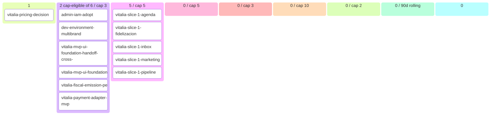

# Vitalia Backlog (auto-generated)

> Generated at: `2026-05-20T04:36:10+00:00`
> DO NOT EDIT MANUALLY — modify source artifacts.
> Regenerate: `python scripts/generate_backlog.py`

## 📊 Roadmap view (filtered + curated)

### 💡 Ideas (1)
- vitalia-pricing-decision `[story]`

### 🔬 Refining (6 total · 2 cap-eligible / cap 3)
- **admin-iam-adopt**
- **dev-environment-multibrand**
- **vitalia-mvp-ui-foundation-handoff-cross-story**
- **vitalia-mvp-ui-foundation**
- **vitalia-fiscal-emission-pe** — outcome `vitalia-mvp-ui-foundation` [AWAITING_PO_DRAFT_DEFERRED_NEXT_SESSION]
- **vitalia-payment-adapter-mvp** — outcome `vitalia-mvp-ui-foundation` [AWAITING_PO_DRAFT_DEFERRED_NEXT_SESSION]

### ✅ Refined — listo para arquitectos (5 / cap 5)
- **vitalia-slice-1-agenda** — outcome `vitalia-mvp-ui-foundation`
- **vitalia-slice-1-fidelizacion** — outcome `vitalia-mvp-ui-foundation`
- **vitalia-slice-1-inbox** — outcome `vitalia-mvp-ui-foundation`
- **vitalia-slice-1-marketing** — outcome `vitalia-mvp-ui-foundation`
- **vitalia-slice-1-pipeline** — outcome `vitalia-mvp-ui-foundation`

### 📦 Ready for development (0 / cap 5)
- _(none)_

### 🔨 Developing (0 / cap 3)
- _(none)_

### 🧪 Developed — esperando QA (0 / cap 10)
- _(none)_

### 🔍 Reviewing (0 / cap 2)
- _(none in review)_

### Recently shipped (last 90d, 0 items)
- _(none recent)_

### Parked (0) · Dropped (0)

---

## 🔄 Operational view (Mermaid kanban)

---

## 📈 Capabilities snapshot

| module | live | in-progress | planned | deprecated | total |
|---|---|---|---|---|---|
| admin | 1 | 0 | 0 | 0 | 1 |
| agentic | 4 | 0 | 0 | 0 | 4 |
| auth | 2 | 0 | 0 | 0 | 2 |
| booking | 2 | 0 | 0 | 0 | 2 |
| brand_studio | 1 | 0 | 0 | 0 | 1 |
| compliance | 2 | 0 | 0 | 0 | 2 |
| connections | 1 | 0 | 0 | 0 | 1 |
| copilot | 3 | 0 | 0 | 0 | 3 |
| crm | 1 | 0 | 0 | 0 | 1 |
| dashboard | 1 | 0 | 0 | 0 | 1 |
| fixtures | 1 | 0 | 0 | 0 | 1 |
| iam | 1 | 0 | 0 | 0 | 1 |
| observability | 3 | 0 | 0 | 0 | 3 |
| offer_studio | 1 | 0 | 0 | 0 | 1 |
| onboarding | 2 | 0 | 0 | 0 | 2 |
| ops | 1 | 0 | 0 | 0 | 1 |
| patients | 1 | 0 | 0 | 0 | 1 |
| payment | 1 | 0 | 0 | 0 | 1 |
| platform | 3 | 0 | 0 | 0 | 3 |
| public_landing | 1 | 0 | 0 | 0 | 1 |
| sales_agent | 3 | 0 | 0 | 0 | 3 |
| tests | 1 | 0 | 0 | 0 | 1 |
| treatments | 1 | 0 | 0 | 0 | 1 |
| workers | 1 | 0 | 0 | 0 | 1 |
| **TOTAL** | **39** | **0** | **0** | **0** | **39** |

