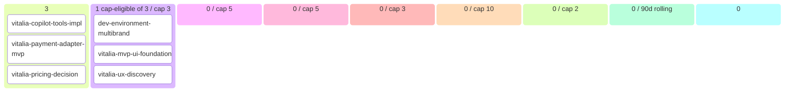

# Vitalia Backlog (auto-generated)

> Generated at: `2026-05-17T08:22:51+00:00`
> DO NOT EDIT MANUALLY — modify source artifacts.
> Regenerate: `python scripts/generate_backlog.py`

## 📊 Roadmap view (filtered + curated)

### 💡 Ideas (3)
- vitalia-copilot-tools-impl `[story]`
- vitalia-payment-adapter-mvp `[story]`
- vitalia-pricing-decision `[story]`

### 🔬 Refining (3 total · 1 cap-eligible / cap 3)
- **dev-environment-multibrand**
- **vitalia-mvp-ui-foundation**
- **vitalia-ux-discovery** — outcome `vitalia-mvp-ui-foundation` [SPEC_V0_RATIFIED]

### ✅ Refined — listo para arquitectos (0 / cap 5)
- _(none)_

### 📦 Ready for development (0 / cap 5)
- _(none)_

### 🔨 Developing (0 / cap 3)
- _(none)_

### 🧪 Developed — esperando QA (0 / cap 10)
- _(none)_

### 🔍 Reviewing (0 / cap 2)
- _(none in review)_

### Recently shipped (last 90d, 0 items)
- _(none recent)_

### Parked (0) · Dropped (0)

---

## 🔄 Operational view (Mermaid kanban)

---

## 📈 Capabilities snapshot

| module | live | in-progress | planned | deprecated | total |
|---|---|---|---|---|---|
| agentic | 2 | 0 | 0 | 0 | 2 |
| booking | 2 | 0 | 0 | 0 | 2 |
| brand_studio | 1 | 0 | 0 | 0 | 1 |
| compliance | 1 | 0 | 0 | 0 | 1 |
| copilot | 2 | 0 | 0 | 0 | 2 |
| fixtures | 1 | 0 | 0 | 0 | 1 |
| offer_studio | 1 | 0 | 0 | 0 | 1 |
| onboarding | 1 | 0 | 0 | 0 | 1 |
| patients | 1 | 0 | 0 | 0 | 1 |
| payment | 1 | 0 | 0 | 0 | 1 |
| platform | 1 | 0 | 0 | 0 | 1 |
| public_landing | 1 | 0 | 0 | 0 | 1 |
| treatments | 1 | 0 | 0 | 0 | 1 |
| **TOTAL** | **16** | **0** | **0** | **0** | **16** |

